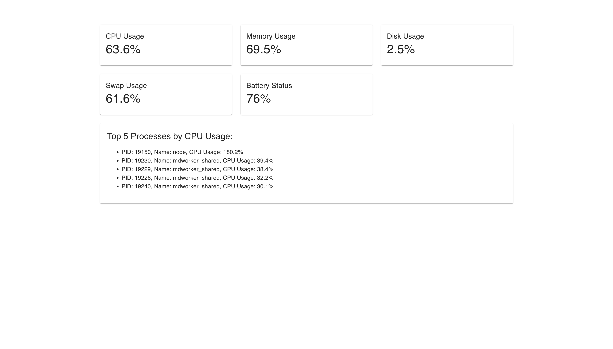

# system-performance-debuggerSystem Performance Debugger (Python & React)

This project is a System Performance Debugger that monitors key system metrics (CPU usage, memory, disk usage, etc.) and displays them in a modern React-based dashboard. It uses a Python backend (Flask) to fetch system performance metrics and a React frontend to display them in a user-friendly way.
Features

Displays system metrics such as CPU, memory, disk, swap usage, and more.
Lists the top 5 processes consuming CPU.
Real-time data fetching and display with a modern Material UI interface.
Technologies Used

Python: Backend API to fetch system metrics.
Flask: Framework for building the backend API.
React: Frontend for displaying the metrics.
Material UI: Styling framework for a modern user interface.
Installation

Prerequisites
Node.js and npm: Required for the React frontend.
Python 3.x: Required for the Flask backend.
Git: Version control for code management.
Setup Instructions
1. Clone the Repository
Clone this repository to your local machine using Git:
git clone https://github.com/your-username/system-performance-debugger.git
cd system-performance-debugger
2. Setting Up the Python Backend
Create a virtual environment (recommended):
python3 -m venv venv
Activate the virtual environment:
On macOS/Linux:
source venv/bin/activate
On Windows:
venv\Scripts\activate
Install the required Python packages:
pip install -r requirements.txt
Start the Python Flask backend:
python system_performance_debugger_api.py
The backend will start at http://127.0.0.1:5000.
3. Setting Up the React Frontend
Navigate to the frontend directory:
cd frontend
Install dependencies:
npm install
Start the React development server:
npm start
The frontend will be available at http://localhost:3000.
4. Access the Dashboard
Once both the Flask backend and React frontend are running:
Open your browser and go to http://localhost:3000.
The system performance metrics will be displayed in real-time.
How It Works

Backend (Python & Flask):
The backend uses the psutil library to collect system performance data such as CPU usage, memory usage, network stats, disk I/O, etc.
These metrics are served via a simple REST API built with Flask, available at /metrics.
Frontend (React & Material UI):
The React app fetches system metrics from the Flask API and displays them using Material UI components such as cards, grids, and typography for a modern look.
Data Updates:
The data is fetched and displayed every 5 seconds, ensuring real-time updates of system metrics.
Contributing

Fork the repository and create your own branch:
git checkout -b feature-name
Make your changes and commit them:
git commit -am "Add new feature"
Push your changes to your forked repository:
git push origin feature-name
Create a Pull Request from your branch to the main branch of the original repository.
License

This project is licensed under the MIT License - see the LICENSE file for details.
Optional Sections:
Demo: You can add a link to a live demo or a screenshot (if applicable).
Troubleshooting: Add common errors and how to fix them.
Credits: Any contributors or libraries/tools used in the project.